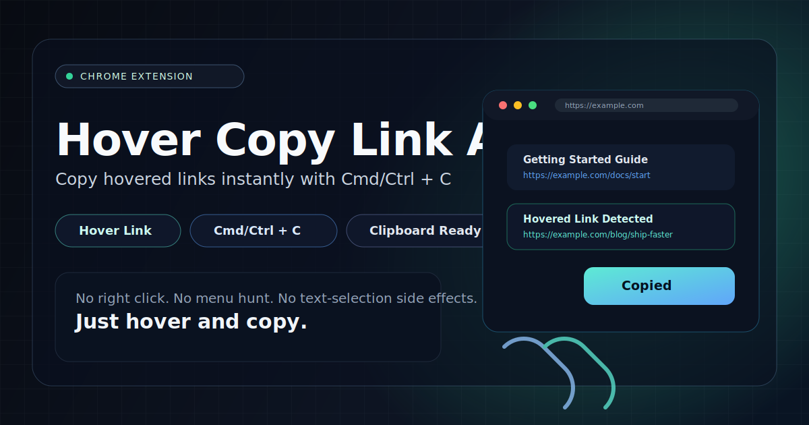

# Hover Copy Link Address

Copy any link URL by hovering over it and pressing `Cmd+C` (`Ctrl+C` on Windows/Linux) — no right-click menu needed.

## Usage

1. Hover over any link on a webpage
2. Press `Cmd+C` (or `Ctrl+C` on Windows/Linux)
3. The link's URL is copied to your clipboard

If you have text selected on the page, `Cmd+C` (`Ctrl+C`) copies your selection as usual — the extension stays out of the way.

## Install

1. Clone or download this repo
2. Go to `chrome://extensions/` in Chrome
3. Enable **Developer mode**
4. Click **Load unpacked** and select this folder

## How It Works

The extension intercepts the `copy` event while you're hovering a link. No hidden DOM elements, no selection manipulation, no focus stealing — just a single event listener that writes the URL to the clipboard via `clipboardData`.

## License

MIT
